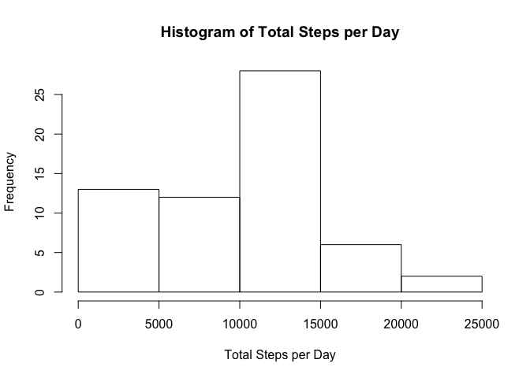
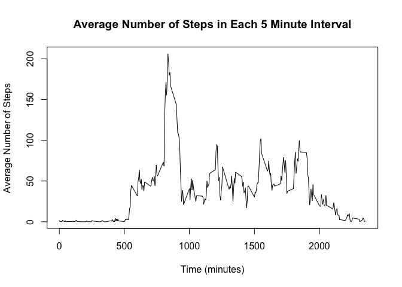
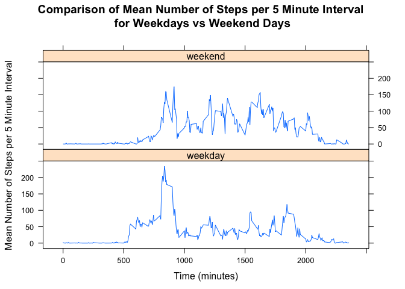

# Reproducible Research: Peer Assessment 1
## Attach packages and set options

```r
library(lubridate)
library(dplyr)
library(lattice)
options(scipen = 9999999)
```

## Loading and preprocessing the data

```r
data <- read.csv("activity.csv", stringsAsFactors = FALSE)
data$date <- ymd(data$date)
```

## What is mean total number of steps taken per day?

```r
data1 <- summarise(group_by(data, date), Total = sum(steps, na.rm = TRUE))
```
Total number steps per day is shown in the histogram below

```r
hist(data1$Total, main = "Histogram of Total Steps per Day", xlab = "Total Steps per Day")
```

<!-- -->

```r
MeanSteps <- round(mean(data1$Total), digits = 0)
MedianSteps <- median(data1$Total)
```

The mean number of steps taken per day is 9354 steps.  
The median number of steps taken per day is 10395 steps.  


## What is the average daily activity pattern?

```r
data2 <- summarise(group_by(data, interval), IntervalMeanSteps = mean(steps, na.rm = TRUE))

plot(data2$interval, data2$IntervalMeanSteps, type = "l", main = "Average Number of Steps in Each 5 Minute Interval",
     xlab = "Time (minutes)", ylab = "Average Number of Steps")
```

<!-- -->

```r
MaxInterval <- data2[data2$IntervalMeanSteps == max(data2$IntervalMeanSteps), 1]
MaxSteps <- round(data2[data2$IntervalMeanSteps == max(data2$IntervalMeanSteps), 2], digits = 0)
```

The interval with the maximum number of steps is 835  
This interval has 206 steps

## Imputing missing values
The total number of missing values in the dataset is 2304  
These missing values may be replaced with the mean number of steps for the corresponding 5 minute interval over all days.  


```r
datanew <- data
datanew$steps <- ifelse(is.na(data$steps) == TRUE, data2$IntervalMeanSteps[data2$interval %in% data$interval], data$steps)
datanew1 <- summarise(group_by(datanew, date), Total = sum(steps, na.rm = TRUE))
hist(datanew1$Total, main = "Histogram of Total Steps per Day (missing data filled)", xlab = "Total Steps per Day")
```

<!-- -->

```r
NewMeanSteps <- round(mean(datanew1$Total), digits = 0)
NewMedianSteps <- round(median(datanew1$Total))
```

The mean number of steps taken per day is 10766 steps with the missing values replaced by mean for the corresponding 5 minute interval.  
The median number of steps taken per day is 10766 steps with the missing values replaced by mean for the corresponding 5 minute interval.  
As can be seen, by replacing the missing values with the corresponding mean for the corresponding 5 minute period both the mean and median have increased.  

## Are there differences in activity patterns between weekdays and weekends?

```r
data$daytype <- ifelse(weekdays(data$date) %in% c("Saturday", "Sunday"), "weekend", "weekday")
data$daytype <- as.factor(data$daytype)
data3 <- summarise(group_by(data, interval, daytype), DayMeanSteps = mean(steps, na.rm = TRUE))
xyplot(data3$DayMeanSteps ~ data3$interval | data3$daytype, layout = c(1, 2), type = "l",
       xlab = "Time (minutes)", ylab = "Mean Number of Steps per 5 Minute Interval",
       main = "Comparison of Mean Number of Steps per 5 Minute Interval \nfor Weekdays vs Weekend Days")
```

<!-- -->


